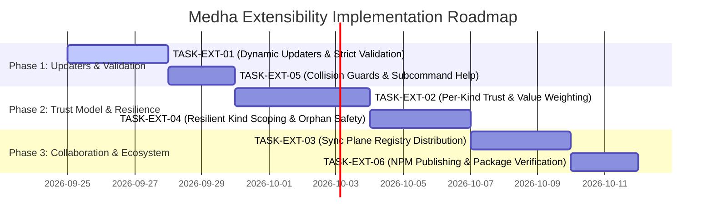

# Medha Extensibility & Trust Engine Roadmap

**Status**: Planned & Filed  
**Author**: Medha Architecture & Engineering Team  
**Context**: Comprehensive evaluation of Medha extension points (Registries, Weight Updaters, Store Backends, Sync Adapters, Library Packages).

---

## Executive Summary

A comprehensive evaluation of Medha's five extension points revealed that while Medha is highly extensible in its **data vocabulary** (custom kinds, signals, anchors, and freeform entity keys work seamlessly), it remains largely **closed in its trust and execution logic**:
1. Custom weight updaters scaffolded with `medha updater fork` are never dynamically loaded by the binary CLI.
2. Unrecognized updater names (`--updater nope`) silently fall back to `ema` instead of throwing an error.
3. Updaters and signal values currently only influence drift detection; the core trust score ($T$) is hardcoded to Wilson lower-bound trial counts ($k/n$) with static global thresholds.
4. Removing an in-use kind from registries throws an unhandled error during `list()` that hides all healthy entities and inappropriately suggests `--recreate` (which destroys data).
5. `medha-sync` synchronizes episodes but omits `registries.json`, requiring manual out-of-band registry coordination between teammates.
6. The `@cntxt-labs/*` packages are not yet published on npm, making library-level integration unreachable for external consumers.

Below are the six filed tasks to transform Medha into a genuinely extensible, enterprise-grade evidential memory engine.

---

## Task Inventory

| Task ID | Priority | Area | Summary | Status |
|---|---|---|---|---|
| [TASK-EXT-01](#task-ext-01-dynamic-loading-of-custom-updaters--strict-validation) | **P0 (Critical)** | CLI & Updaters | Load `<home>/updaters/*.ts` in binary CLI; fail loudly on unknown updaters; fix scaffold template. | **Completed** |
| [TASK-EXT-02](#task-ext-02-per-kind-trust-configuration--value-weighted-evidence) | **P0 (Critical)** | Core Engine | Allow per-kind trust thresholds, recency half-life, and signal-value-weighted evidence in `registries.json`. | **Completed** |
| [TASK-EXT-03](#task-ext-03-registry-synchronization--pull-auto-import) | **P1 (High)** | Sync Plane | Carry registry definitions in `medha-sync`; provide interactive or flag-driven auto-import on `pull`. | **Completed** |
| [TASK-EXT-04](#task-ext-04-resilient-kind-scoping--graceful-orphan-handling) | **P1 (High)** | Store & Preflight | Scope unknown-kind errors to affected entities; never hide unaffected data; deprecate false `--recreate` advice. | **Completed** |
| [TASK-EXT-05](#task-ext-05-builtin-registry-collision-guards--nested-cli-help) | **P2 (Medium)** | CLI & Registries | Reject silent dropping of built-in redefinitions (`APPLY`); fix nested sub-command `--help` routing. | **Completed** |
| [TASK-EXT-06](#task-ext-06-npm-package-publishing-pipeline--docs-realignment) | **P2 (Medium)** | Packaging & Docs | Establish automated npm publishing pipeline for `@cntxt-labs/*`; update documentation. | **Planned** |

---

## Detailed Task Specifications

### TASK-EXT-01: Dynamic Loading of Custom Updaters & Strict Validation

#### 1. Problem Statement
- Running `medha updater fork ema` creates `<home>/updaters/ema-fork.ts`, but `medha updater list` only ever lists the four built-in updaters (`ema`, `wilson`, `sliding-window`, `asymmetric-penalty`).
- Passing `--updater ema-fork` or an invalid name like `--updater nope` to `medha record` is silently accepted and folded with the default `ema` updater.
- The scaffold template generated by `medha updater fork` exports a toy hardcoded logic (`+0.05 / -0.1`), names the updater `${baseName}-custom` regardless of file name, and contains outdated references to `Sage` and `SageOptions`.

#### 2. Root Cause
- In [`cli/src/open.ts`](file:///e:/AI%20projects/sutras/medha/cli/src/open.ts), `new Medha({ store })` is called without instantiating or passing an `UpdaterRegistry` loaded from the project directory.
- In [`cli/src/write.ts`](file:///e:/AI%20projects/sutras/medha/cli/src/write.ts) and [`medha/src/updater-registry.ts`](file:///e:/AI%20projects/sutras/medha/medha/src/updater-registry.ts), missing updaters trigger a silent fallback (`getBuiltinUpdater(...)` falls back to `DEFAULT_UPDATER = 'ema'`).

#### 3. Technical Requirements
1. **Dynamic ESM Loader**:
   - In `cli/src/open.ts`, inspect `<home>/updaters/` for any `*.ts`, `*.js`, or `*.mjs` files.
   - Dynamically import each file using native ESM `await import(pathToFileURL(filePath).href)`.
   - Validate that each module exports a compliant `MedhaWeightUpdater` object (`name` string and `computeWeight` function).
   - Register discovered updaters into `UpdaterRegistry` under the `project` tier.
2. **Strict CLI Validation**:
   - In `cli/src/write.ts`, when `--updater <name>` is provided, verify against `opened.engine.updaters.hasUpdater(name)`.
   - If not found, throw `UpdaterNotFoundError(name, availableNames)` and exit with code 1.
3. **Template Realism & Parity**:
   - In `cli/src/updater.ts`, generate true functional copies of the forked builtin algorithm (e.g. forking `ema` produces real EMA math with customizable $\alpha$, forking `asymmetric-penalty` produces real penalty math).
   - Rename all comments to `Medha` and export the correct updater name matching the file name.

---

### TASK-EXT-02: Per-Kind Trust Configuration & Value-Weighted Evidence

#### 1. Problem Statement
- In Medha, trust $T$ is currently computed strictly as:
  $$T = \min(C, D \cdot \lambda \cdot G \cdot W)$$
  where Wilson score $W$ counts unweighted trial numbers ($k$ successes out of $n$ trials).
- A signal's `value` property (e.g. `TOOL_TIMEOUT` with `value: -0.5` vs `TOOL_CRASH` with `value: -1.0`) is ignored by trust—both count identically as 1 failure ($k+0, n+1$).
- Trust thresholds (`TRUSTED_THRESHOLD = 0.8`, `ACTIVE_THRESHOLD = 0.5`, `UNGUARDED_TRUST_CEILING = 0.5`, `RECENCY_HALF_LIFE_DAYS = 14`) are globally hardcoded in `medha-core`. Different kinds (e.g. `tool` vs `rule` vs `flaky-test`) cannot specify custom bars.

#### 2. Root Cause
- [`medha-core/src/thresholds.ts`](file:///e:/AI%20projects/sutras/medha/medha-core/src/thresholds.ts) exports static constants.
- [`medha-core/src/temporal.ts`](file:///e:/AI%20projects/sutras/medha/medha-core/src/temporal.ts) and [`medha/src/projection.ts`](file:///e:/AI%20projects/sutras/medha/medha/src/projection.ts) do not accept per-kind parameter overrides.

#### 3. Technical Requirements
1. **Schema Extension in `registries.json` / `config.json`**:
   - Allow kinds to declare an optional `trustConfig`:
     ```json
     {
       "kinds": {
         "tool": {
           "description": "External LLM tools & MCP servers",
           "thresholds": {
             "trusted": 0.95,
             "active": 0.70,
             "unguardedCeiling": 0.60,
             "minUsesForTrusted": 20
           },
           "recency": {
             "halfLifeDays": 7
           },
           "evidenceWeighting": "signal-value"
         }
       }
     }
     ```
2. **Signal-Value Weighted Evidence**:
   - If `evidenceWeighting === 'signal-value'`:
     - Trials accumulate $|v|$ (or custom weight).
     - Successes accumulate $\max(0, v) \cdot \text{countsAsSuccess}$.
     - Graded failures (e.g. $-0.5$ vs $-1.0$) scale the penalty appropriately in the evidential aggregation.
3. **Engine & CLI Inspection**:
   - Update `medha explain-threshold --id <id>` and `medha params` to reflect effective per-kind parameters.

---

### TASK-EXT-03: Registry Synchronization & Pull Auto-Import

#### 1. Problem Statement
- `medha-sync` transfers episode streams between repositories/machines via Git refs or files.
- However, if Repo B pulls episodes referencing custom kinds or signals defined only in Repo A, `medha sync pull` aborts with `UnknownKindError`. Teams have to manually copy `registries.json`.

#### 2. Root Cause
- The `SyncPackage` manifest in [`medha-sync`](file:///e:/AI%20projects/sutras/medha/medha-sync) serializes only the episode log, leaving `config.json` / `registries` out-of-band.

#### 3. Technical Requirements
1. **Sync Package Manifest Enhancement**:
   - Include a snapshot of custom kinds, signals, and anchors in the sync export package (`sync.manifest.registries`).
2. **Interactive & Automated Ingestion on Pull**:
   - On `medha sync pull`, compare incoming registries against local `config.json`.
   - If missing kinds/signals are found:
     - When `--auto-import-registries` is passed, merge them into local `config.json` automatically.
     - When run interactively, prompt user: `Incoming sync contains 2 custom kinds (tool, prompt). Import? [Y/n]`.
     - When in non-interactive mode without the flag, fail cleanly with a structured diff explaining how to import.

---

### TASK-EXT-04: Resilient Kind Scoping & Graceful Orphan Handling

#### 1. Problem Statement
- If a user removes a kind from `config.json` that has historical episodes in the database:
  - `medha list` crashes or returns empty for the *entire* store, hiding rules, recipes, and tools whose kinds are valid.
  - The CLI suggests `--recreate`, which would wipe the user's valid historical database!
  - `medha sync push` reports success (0 entities pushed), masking the failure.

#### 2. Root Cause
- In [`medha/src/engine.ts`](file:///e:/AI%20projects/sutras/medha/medha/src/engine.ts), `list()` iterates over all store states and executes `requireKind(key)` eagerly before filtering. Any unknown kind halts the entire query with a fatal exception.

#### 3. Technical Requirements
1. **Graceful Entity Degradation**:
   - Instead of marking the entire store corrupt, entities whose kind is unmapped should be labeled with status `quarantined` or special sub-status `orphaned-kind`.
   - `medha list` without filters must continue returning all valid entities, while listing orphaned entities with an explicit warning badge.
2. **Diagnostic Guidance**:
   - `medha maintain preflight` should report: `Found 3 entities with unregistered kind 'flaky-test'. Data is safe. Restore 'flaky-test' to registries or run 'medha maintain prune --kind flaky-test'.`
   - Explicitly remove any advice suggesting `--recreate` when the database integrity is healthy.

---

### TASK-EXT-05: Built-In Registry Collision Guards & Nested CLI Help

#### 1. Problem Statement
- Redefining a built-in signal (e.g. attempting to override `APPLY` with `value: 0.5`) in `registries.json` is silently ignored during `medha init`.
- Running `medha updater fork --help` displays the root command help (`USAGE medha [OPTIONS]`) instead of subcommand options (`--name`, `--out`).

#### 2. Root Cause
- Built-in signals in `KindRegistry` / `SignalRegistry` prioritize built-ins and silently drop matching incoming definitions without logging or validation.
- Command tree routing in `citty` does not consume nested subcommand `--help` flags.

#### 3. Technical Requirements
1. **Explicit Collision Validation**:
   - If a custom config attempts to redefine a built-in kind or signal without an explicit `{ overrideBuiltin: true }` attribute, throw `BuiltinCollisionError("Cannot redefine built-in signal 'APPLY' without explicit override permission")`.
2. **Subcommand Help Delegation**:
   - Update `cli/src/bin.ts` and `cli/src/commands.ts` so nested commands (`updater fork`, `maintain backup`, etc.) parse `--help` in their local scope and print accurate subcommand flags.

---

### TASK-EXT-06: NPM Package Publishing Pipeline & Documentation Realignment

#### 1. Problem Statement
- Documentation instructs developers that they can import `@cntxt-labs/medha`, `@cntxt-labs/medha-core`, etc., in Node/Bun code.
- None of the packages exist on npm (all 404).

#### 2. Technical Requirements
1. **Release Automation**:
   - Add `.github/workflows/publish.yml` with provenance, OTP handling, and changeset integration.
   - Verify package `package.json` manifests (`main`, `module`, `types`, `exports`, `publishConfig: { access: "public" }`).
2. **Documentation Accuracy**:
   - Clearly delineate in `README.md` and `SKILL.md` what features are CLI/MCP native versus what features require the TypeScript SDK once published.

---

## Suggested Implementation Roadmap


